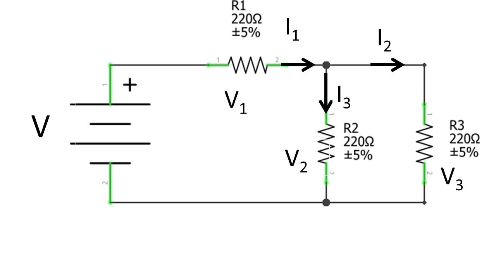
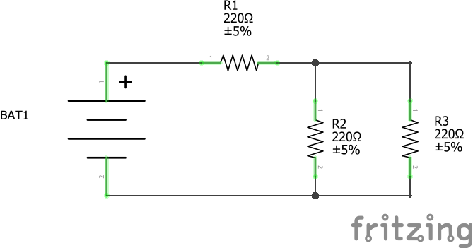
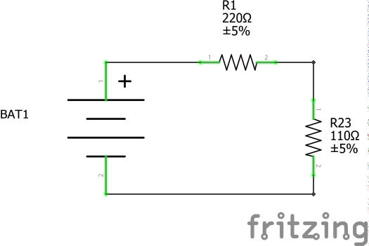
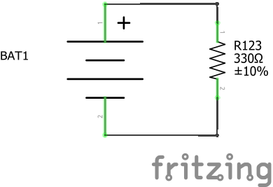

# Kirchoffi ja Oomi seaduste ülesanne

Antud skeemis on lihtne ahel kus saame rakendada Oomi kui ka Kirchoff'i seaduseid. *V1* näiteks tähistab pingelang takistuses *R1* samamoodi kui *I1* tähistab voolutugevus mis läheb selle takistuse läbi.

Sinu ülesanne on koostada esimese skeemi ahelat.
Esimene variant oleks kõik takistused sama väärtusega:

*R1* = *R2* = *R3* = 220 Ω

See oleks variant mis on pildi peal.

Kuna *R2* ja *R3* on rööpühenduses:

1/R23 = 1/*R2* + 1/*R3*

R23 = (*R2*+*R3*)/*R2***R3*

Eelmise skeemi saab lihtsustada nii:

Kuna *R1* ja R23 on jadaühenduses:

Rkokku = *R1* + R23

Eelmise skeem saab lihtsustada nii, et jääks nii:

Mõõta mis on pingete, takistuste ja voolutugevuse väärtuseid.

*V1*, *R1*, *I1*

*V2*, *R2*, *I2*

*V3*, *R3*, *I3*

## Kirchoff'i seadused
Nende mõõtmistega pead tõestama, et:

### (Kirchoff'i esimene seadus)

*I1* = *I2* + *I3*
 
### (Kirchoff'i teine seadus)

V = *V1* + *V2*

V = *V1* + *V3* 
 

## Teine variant 

Kui sa oled seda juba ära teinud võid proovida teiste takistuste väärtuste võrdlemiseks. Nt:

*R1* = *R2* = 220 Ω

*R3* = 10 kΩ